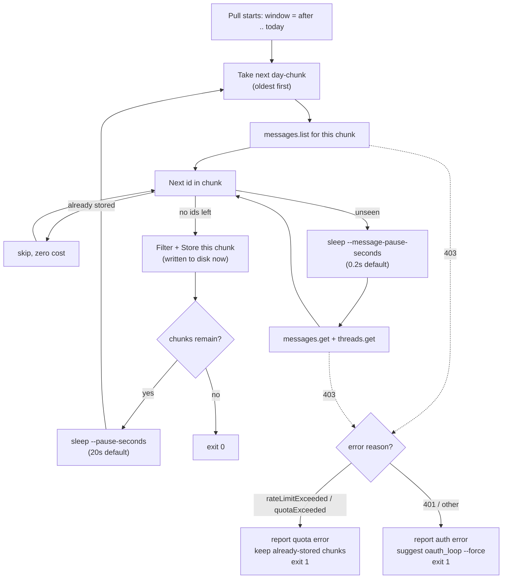

# Inbound feeds

Localhost Desktop OAuth against Google Cloud project
`personal-os-inbound-feeds`, client `personal-os-inbound-feeds-desktop`. Connect
is `oauth_loop.py`. ULC Gmail Pull → Filter → Store is `intake.py`. Calendar
live read for Daily Planning is `calendar_read.py`. Vault design:
`Notes/Inbound Feeds Connectors.md` → Token files, OAuth setup runbook,
Design stubs. Filter policy: `Management/Intake/Intake Rules.md`.

## What Connect writes


| Source            | Token file                                                          |
| ----------------- | ------------------------------------------------------------------- |
| ULC Gmail         | `~/.config/personal-os-inbound-feeds/tokens/ulc_gmail.json`         |
| Personal Gmail    | `~/.config/personal-os-inbound-feeds/tokens/personal_gmail.json`    |
| ULC Calendar      | `~/.config/personal-os-inbound-feeds/tokens/ulc_calendar.json`      |
| Personal Calendar | `~/.config/personal-os-inbound-feeds/tokens/personal_calendar.json` |


The file is Google `authorized_user` JSON (`refresh_token`, `token_uri`,
`client_id`, `client_secret`). Mode `0600`. Never put this directory under
`personal-os/` or the vault.

Client ID and Secret stay in the password manager. The loop copies them into
the token file because `google-auth-oauthlib` expects that shape.

## Setup

```bash
python3 -m venv .venv
./.venv/bin/pip install -r requirements.txt
```

Credentials, pick one:

- Env: `PERSONAL_OS_INBOUND_FEEDS_CLIENT_ID` and
`PERSONAL_OS_INBOUND_FEEDS_CLIENT_SECRET`
- File: `~/.config/personal-os-inbound-feeds/client.json` as either Google's
Desktop `installed` JSON or `{"client_id": "...", "client_secret": "..."}`

Do not paste secrets into chat or vault notes. The Playground Web client is
rejected; use the Desktop client.

## Connect

```bash
./.venv/bin/python oauth_loop.py --source ulc_gmail
./.venv/bin/python oauth_loop.py --source personal_gmail
./.venv/bin/python oauth_loop.py --source ulc_calendar
./.venv/bin/python oauth_loop.py --source personal_calendar
```

A browser window opens. Sign in as that Account and Allow. Success prints the
token path and `Gmail list status: 200` or `Calendar list status: 200`.

```bash
./.venv/bin/python oauth_loop.py --source ulc_gmail --probe-only   # reuse token
./.venv/bin/python oauth_loop.py --source ulc_calendar --force     # re-consent
```

Testing-app refresh tokens expire on the order of seven days. Re-run `--force`
when Gmail or Calendar starts returning auth errors. `intake.py` and
`calendar_read.py` reuse these tokens and do not open a browser. If the file
is missing, run Connect. If the API returns 401 or 403 after a refresh, run
`--force`.

## Turning Gmail into vault notes

Management Intake Processing pulls messages from the ULC Gmail and Personal Gmail accounts into the vault as notes before anyone processes them. The pull can cover up to a week of messages, so it calls the Gmail API in a way that stays under Gmail's request budget instead of fetching the whole week in one burst.

The workflow is triggered in the agent chat through trigger phrases such as `pull raw inputs` or `process raw inputs`. They lead to running the `intake.py` script against a Gmail source through the following commands:

```bash
./.venv/bin/python intake.py --source ulc_gmail
./.venv/bin/python intake.py --source personal_gmail
./.venv/bin/python intake.py --source ulc_gmail --dry-run
```

Each run works over a *window*, the span of days computed as all days since the ledger's last processed date or the 7-day trailing window, whichever is smaller. Since Gmail enforces a request limit on its API, the run does not fetch the entire window in one pass. Instead it divides the window into day-sized *chunks*, sized by `--window-days` and one day by default, and works through them oldest first. Every message that Intake Rules allows, from any chunk in the window, lands in the same single intake file for that day's run, written into `Management/Intake/`. This works in three stages: pull, filter, and store.

- *Pull* fetches messages by calling the Gmail API. It skips ids already on file and paces the calls it does make, to stay under Gmail's rate limit rather than recovering after it is hit.
- *Filter* decides whether a fetched message is worth keeping. It implements the Intake Rules that keep marketing email, automated notices, and cold outreach out of the vault. This design lets Intake Rules change without touching how messages are fetched or stored.
- *Store* writes the allowed messages into the vault. It turns every message into the vault's format: one markdown file per source per run, one section per message, and a small block of metadata on each section recording the Gmail id so future pulls can identify messages already fetched.

Once Pull fetches the messages for a day chunk, Filter and Store finish writing that chunk before Pull starts fetching the next one. If a fetch inside a chunk fails, Pull does not retry it and does not move on to the chunks after it: the run stops right there, with exit code 1. Chunks that finished before the failure keep their output on disk; the chunk that failed and every chunk still ahead of it in the window are simply never fetched in this run. Running the same command again later picks them up, since the id check makes the chunks that already finished free the second time. Beyond this stop-and-resume behavior, the design addresses Gmail's rate limit itself with two mechanisms.

- Reducing the number of API calls. Within a chunk, Pull checks every message id against what Store has already written for that source, and only a genuinely new id is fetched with an API request. An id already on file costs nothing beyond the `messages.list` call that returned it.
- Spacing the API calls out. Gmail's rate limit is enforced per second rather than per minute, so a single chunk with a large burst of new messages can still exceed the quota even after the id check removes the ones already on file. Pull spaces its calls out at two levels.
  - Between individual fetches, controlled by `--message-pause-seconds` and 0.2 seconds by default. This is what keeps a chunk's own burst of `messages.get` and `threads.get` calls under the per-second limit.
  - Between chunks, controlled by `--pause-seconds` and 20 seconds by default. This gives the next chunk a gap from the one before it, rather than starting immediately after.

The Examples below show both a run that hits the limit and stops, and the same mailbox passing once pacing is in place.

## Examples

The first example uses `gmail-account1` to illustrate the effect of the mechanism that reduces API volume. For one chunk, `messages.list` returns 66 ids for that day; 29 are already stored, so Pull fetches only the remaining 37, 0.2 seconds apart. That cuts the chunk's Gmail calls from a possible 133 (1 + 66 × 2) to 75 (1 + 37 × 2), and the fraction skipped grows on every later run as more of the window is already on file.

The second example uses `gmail-account2` to illustrate the effect of the spacing mechanism within a chunk. Before `--message-pause-seconds` existed, this mailbox's backlog tripped `rateLimitExceeded` on a `messages.get` call partway through the seven-day window, after 112 messages had already been fetched, classified, and stored across the earlier chunks. Pull did not retry that call and did not move on to the remaining chunks: it printed the quota error to stderr and `main` returned exit code 1 right there. The 112 already stored were not lost, but nothing past that point got fetched until the command was run again. After adding the 0.2-second pause between individual fetches, the same mailbox's burst was gone, and the same seven-day window completed in a single run, all 212 messages fetched, classified, and stored, with no 403 at all. This is why `--message-pause-seconds` defaults to 0.2 rather than 0.

A run that still fails partway, for any mailbox, is safe to just re-run: the id check means every chunk already on file costs nothing but a `messages.list` call the second time.

A 401, or a 403 whose reason is not `rateLimitExceeded` or `quotaExceeded`, takes the other branch in the diagram below: Pull reports a genuine auth failure and asks for `oauth_loop.py --force`, since re-authenticating does nothing for a quota problem and waiting does nothing for a stale token.




A message that Filter keeps or marks borderline becomes a `##` section inside `Management/Intake/YYYY-MM-DD Pulled ULC Gmail.md` or the Personal Gmail equivalent, with frontmatter recording the source, account, and pull time, and a metadata block per section recording the Gmail id, thread id, sender, subject, and classification. A dropped message never reaches that file. Its id and drop reason are appended instead to a separate log under `~/.local/share/personal-os-inbound-feeds/drops/`, so a drop can be audited without cluttering the vault. Store never touches Raw Inputs files or the five management brain folders, and it never advances the ledger date itself, since deciding a batch has been processed is a separate, deliberate step. Passing `--dry-run` runs Pull and Filter as usual and prints the keep, borderline, drop, and skipped counts, but stops before Store writes anything.

## Calendar live read

```bash
./.venv/bin/python calendar_read.py
./.venv/bin/python calendar_read.py --date 2026-08-13
```

Daily Planning runs this at sequence time. It reads primary calendars for
every calendar token that exists (ULC and Personal), then prints timed
events, all-day events, free blocks from 08:00–18:00 local, and overlaps.
It does not write the vault. Missing tokens exit 2 with an oauth_loop hint.
Auth errors exit 1 with `--force`.

## Spec & tests

Rule: run the tests before committing any change to this tool, and keep them
green. The tests are the executable spec. They do not call Google or the live
vault.

Hard gate (pre-commit hook): a tracked hook blocks any commit that touches this
tool if its tests fail. Install once per clone:

```bash
bash hooks/install.sh
```

The dispatcher runs this tool's tests when `inbound-feeds/` files are staged.
Emergency bypass (discouraged): `git commit --no-verify`.

```bash
./.venv/bin/python -m unittest discover -s tests -v
```

What they pin down:

- Source name ULC Gmail maps to `ulc_gmail.json`, not `ulc.json` or `gmail.json`
- Source name Personal Gmail maps to `personal_gmail.json`, not `gmail.json`
- Scope is the full `gmail.readonly` URI
- Token writes stay under `~/.config/personal-os-inbound-feeds/tokens/` and
outside the repo and vault
- `authorized_user` JSON has `refresh_token`, `token_uri`, `client_id`,
`client_secret`
- Desktop client JSON is accepted; Playground Web client JSON is rejected
- The Gmail list helper returns the HTTP status from a mocked session
- Intake filename is `YYYY-MM-DD Pulled ULC Gmail.md` with frontmatter
`source: ULC Gmail`, `account: ulc`, `status: unprocessed`
- Pull window uses the ledger date when it is within seven days, otherwise
the last seven days
- Missing token exits 2 without opening OAuth; mocked Gmail 401 exits 1 with
a `--force` hint
- People `types: contact` keep on email or display name; the mailbox owner
and Role Self do not keep the whole inbox
- Calendar RSVP, marketing `List-Unsubscribe`, and receipts drop even when a
People contact is on the thread
- Sequel / ULC mail with substance keeps; empty calendar-accept from that
domain still drops
- New sender on a known vendor domain is borderline with `needs_review: true`
- Cold outreach drops; `gmail_id` already in a Pulled file is skipped
- Store refuses Raw Inputs paths and does not write the five Management
folders
- Calendar sources map to `ulc_calendar.json` and `personal_calendar.json`
with the full `calendar.readonly` URI
- Free blocks subtract timed events from 08:00–18:00; adjacent events do not
count as conflicts; cancelled events are skipped
- Missing calendar token exits 2; mocked Calendar 401 exits 1 with a
`--force` hint

